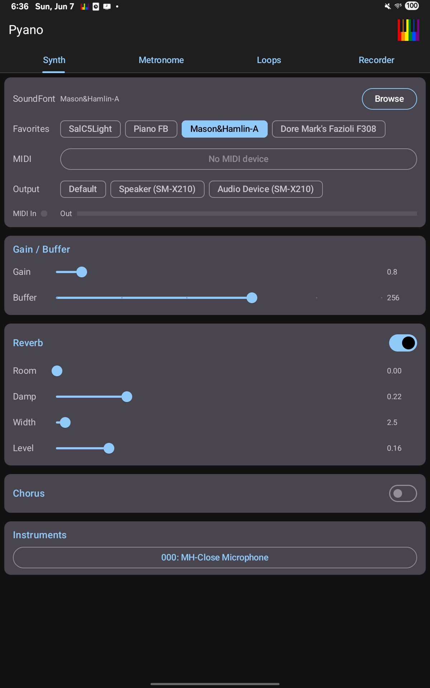
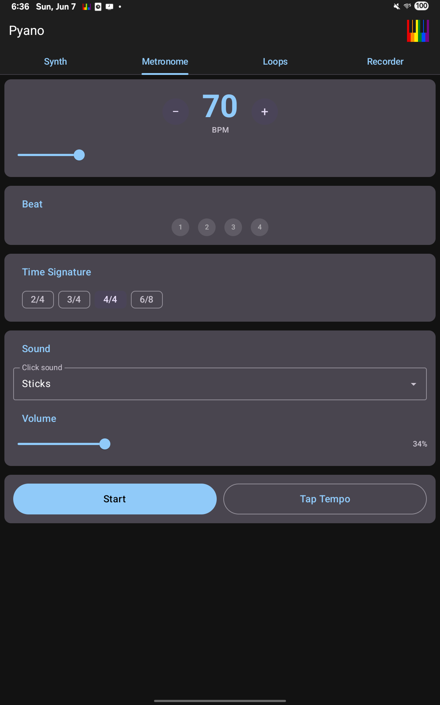
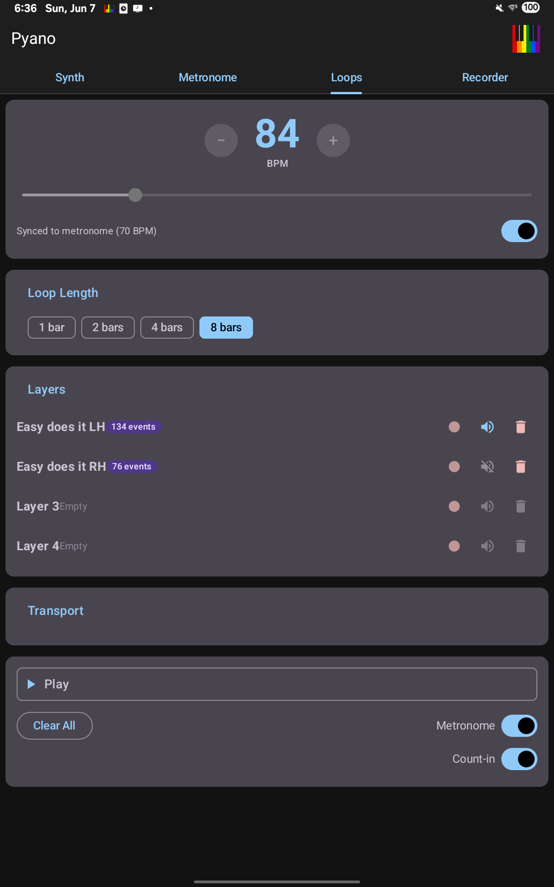
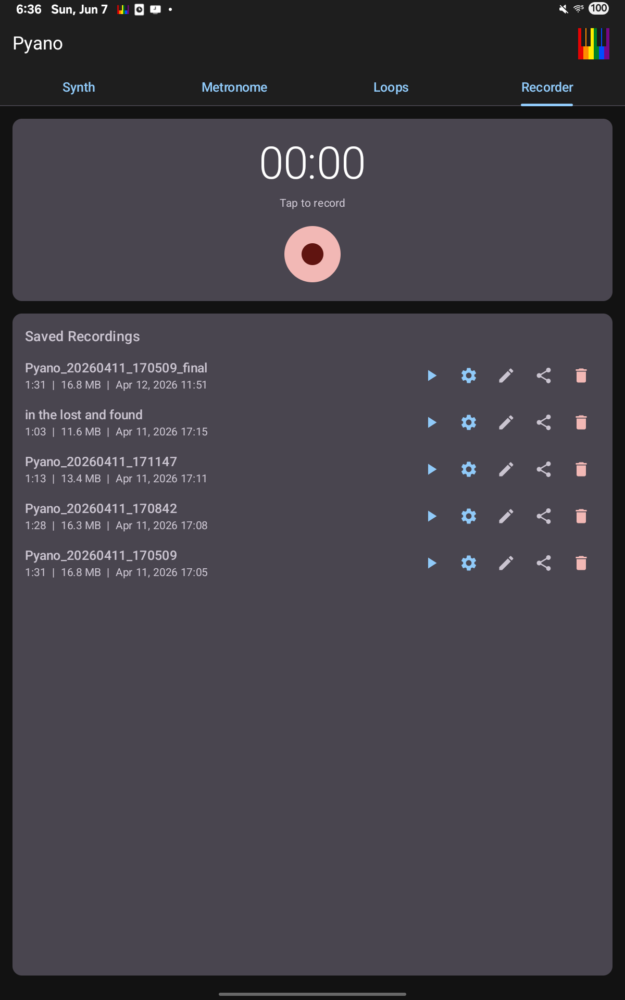
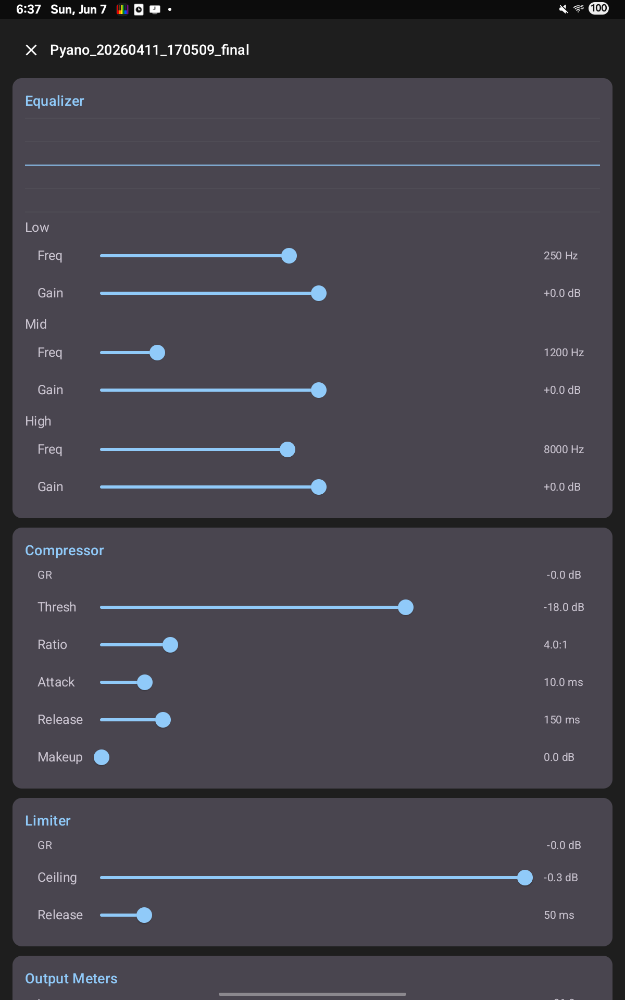

# Pyano

A MIDI-to-SoundFont synthesizer — turn a MIDI keyboard into a real instrument, on Linux and Android.

> _This repo was generated entirely by Claude._

## Overview

Pyano renders live MIDI input through [FluidSynth](https://github.com/FluidSynth/fluidsynth)
and a user-supplied `.sf2` SoundFont, giving you a low-latency software instrument
driven by any connected MIDI controller. The repo ships **two independent
implementations of the same idea**, each in its own directory:

- **`platform_linux/`** — a Python 3 command-line synth (`pyano.py`). Plug in a
  MIDI keyboard, point it at a SoundFont, and play. Auto-detects MIDI port and
  audio device, with full reverb/chorus/gain/buffer controls.
- **`platform_android/`** — a Kotlin / Jetpack Compose app backed by native
  C/C++ (Oboe + FluidSynth). A full mobile music workstation: synth, metronome,
  loop station, recorder, and a mastering DSP suite.

Both platforms share the same conceptual core: a FluidSynth synthesis engine fed
by a MIDI event stream, mixed out through the platform's lowest-latency audio path.

## Screenshots

The Android app (tablet, portrait):

<table>
  <tr>
    <td align="center"><br>Synth</td>
    <td align="center"><br>Metronome</td>
    <td align="center"><br>Loop Station</td>
    <td align="center"><br>Recorder</td>
    <td align="center"><br>Mastering</td>
  </tr>
</table>

## Features

### Linux CLI (`platform_linux/`)

- Live MIDI-keyboard playback through any `.sf2` SoundFont via FluidSynth.
- Auto-detection of the MIDI input port (prefers non-"Through" ports; accepts a
  port name or index via `--port`).
- Auto-detection of the ALSA playback device (matches an Arturia interface by
  default; override with `--device`).
- Selectable audio driver: `alsa`, `pipewire`, `jack`, `pulseaudio`.
- Low-latency tuning: configurable period size / buffer (`--buffer`, default 256)
  and gain (`--gain`).
- Full reverb controls (room, damping, width, level) and chorus controls
  (voices, level, speed, depth, sine/triangle waveform); either can be disabled.
- `--list` to enumerate MIDI ports; an interactive test-tone fallback that plays
  typed note numbers when no MIDI port is present.
- Filters out CC7 (volume) and CC11 (expression); forwards other control changes.

### Android app (`platform_android/`)

- **Synth** — touch keyboard and live MIDI (USB host) into FluidSynth, with a
  SoundFont browser and an effects panel.
- **Metronome** — BPM control with audible click.
- **Loop Station** — multi-layer MIDI looper: per-layer record/overdub, mute,
  rename, and persisted loops across sessions.
- **Recorder** — captures audio to PCM and exports `.wav`.
- **Mastering** — a stereo DSP chain: 3-band parametric EQ (RBJ biquads),
  envelope-follower compressor, and a brick-wall lookahead limiter.
- Native low-latency audio through **Oboe**; a robust hand-written MIDI parser;
  a foreground media service for background playback.

## Tech stack

| Area | Linux CLI | Android app |
| --- | --- | --- |
| Language | Python 3 | Kotlin 2.0.0 + C/C++ (C17 / C11) |
| UI | argparse CLI | Jetpack Compose (Material 3) |
| Synth core | FluidSynth (via `pyfluidsynth`) | FluidSynth 2.3.3 (native `.so`) |
| Audio I/O | ALSA / PipeWire / JACK / PulseAudio | Oboe 1.9.0 |
| MIDI | `mido` + `python-rtmidi` | Android MIDI API + custom parser |
| Build | `pip` (`requirements.txt` / `pyproject.toml`) | Gradle 8.9, AGP 8.5.0, NDK + CMake 3.22.1 |
| Targets | Linux desktop | SDK 26+ (min/target/compile 26/35/35), JVM 17 |

## Architecture

The Android app is layered; the Linux CLI is a single module wrapping the same
synth core:

```
Android:
  ui/ (Compose tabs)
        │
        ▼
  PyanoViewModel ──► midi/ (device mgr + event parser)
        │
        ▼
  audio/ (FluidSynthEngine, LoopEngine, AudioRecorder, MasteringEngine)
        │  JNI
        ▼
  cpp/ (native-lib.c, audio-engine.cpp) ──► Oboe (RT callback) + FluidSynth

Linux:
  pyano.py ──► mido (MIDI in) ──► fluidsynth.Synth ──► ALSA/PipeWire/JACK/Pulse
```

On both platforms the synthesis core is FluidSynth loading a `.sf2` SoundFont;
the difference is the host language and the real-time audio path (Oboe on
Android, the FluidSynth audio driver on Linux).

## Build & Run

### Linux CLI

Requires a system FluidSynth/ALSA stack and a `.sf2` SoundFont (not included —
the MIT-licensed [FluidR3_GM](https://member.keymusician.com/Member/FluidR3_GM/)
is a good default).

```bash
# Install dependencies
pip install -r platform_linux/requirements.txt
# or, once pyproject.toml is present, install the package + `pyano` command:
pip install platform_linux/

# Run against a SoundFont
python3 platform_linux/pyano.py path/to/soundfont.sf2
#   (or, after `pip install`):  pyano path/to/soundfont.sf2

# List MIDI ports / play without a keyboard
python3 platform_linux/pyano.py --list
python3 platform_linux/pyano.py path/to/soundfont.sf2   # type note numbers if no port
```

### Android

**Prerequisites:** Android SDK platforms 34 & 35, the NDK, CMake **3.22.1**, and
**JDK 21** (Gradle 8.9 does not run on JDK 24/25 — use 21).

Important gotchas before your first build:

1. **FluidSynth native libraries are NOT included** (gitignored). You must supply
   `libfluidsynth.so` for each ABI plus the public headers, laid out exactly as
   the CMake build expects (see
   `platform_android/app/src/main/cpp/CMakeLists.txt`):

   ```
   platform_android/fluidsynth-libs/
     ├── arm64-v8a/libfluidsynth.so
     ├── armeabi-v7a/libfluidsynth.so
     ├── x86_64/libfluidsynth.so
     └── include/            # fluidsynth.h + fluidsynth/ headers
   ```

   FluidSynth is **LGPL-2.1**; build it from
   <https://github.com/FluidSynth/fluidsynth> with the Android NDK.
2. **Oboe is fetched automatically** at build time (CMake `FetchContent`,
   tag 1.9.0) — no manual setup.
3. **A `.sf2` SoundFont is needed at runtime.** Provide one through the in-app
   SoundFont browser (none is bundled).
4. **Signing:** debug builds need nothing. The release build reads its keystore
   credentials from environment / Gradle properties (after the concurrent
   security fix); supply those before `assembleRelease`.

> Note: the full Gradle wrapper — `gradlew`, `gradlew.bat`,
> `gradle/wrapper/gradle-wrapper.properties`, and `gradle/wrapper/gradle-wrapper.jar`
> — is committed, so `./gradlew` works out of the box on a fresh clone.

```bash
cd platform_android
./gradlew assembleDebug
./gradlew installDebug
```

> **Build status:** For the Android app, only the debug-signed build
> (`./gradlew assembleDebug`) is currently configured and tested; no signed
> release build is set up. Release signing reads its keystore credentials from
> environment variables / Gradle properties, but no keystore is included — you
> must supply your own to produce a release APK. (The Linux CLI has no build
> step — it just runs via Python — so this caveat applies only to Android.)

## Tests

Test scaffolding is being added concurrently.

```bash
# Linux: lint + type-check + unit tests (ruff + mypy + pytest)
cd platform_linux && ./run-tests.sh

# Android: JVM unit tests
cd platform_android && ./gradlew testDebugUnitTest
```

## Project structure

```
.
├── platform_linux/
│   ├── pyano.py            # CLI synth (argparse, FluidSynth, mido)
│   └── requirements.txt    # pyfluidsynth, mido, python-rtmidi
├── platform_android/       # Kotlin + Compose + native C/C++ app (com.pyano)
│   ├── app/src/main/
│   │   ├── java/com/pyano/
│   │   │   ├── ui/         # Compose tabs (Synth, Metronome, Loop, Recorder, Mastering)
│   │   │   ├── audio/      # FluidSynthEngine, LoopEngine, AudioRecorder, MasteringEngine
│   │   │   ├── midi/       # MidiDeviceManager, MidiEventHandler
│   │   │   └── *.kt        # MainActivity, PyanoViewModel, PyanoAudioService
│   │   └── cpp/            # native-lib.c, audio-engine.cpp, CMakeLists.txt (Oboe + FluidSynth)
│   └── fluidsynth-libs/    # user-supplied native libs + headers (gitignored)
└── docs/screenshots/       # tablet captures used above
```

## License & attribution

Pyano is released under the [MIT License](./LICENSE) — Copyright (c) 2026 Ryan Cox.

Third-party components Pyano uses (including ones not committed to this repo, such
as the FluidSynth libraries and the SoundFont) are documented, with their licenses
and obligations, in [THIRD_PARTY_NOTICES.md](./THIRD_PARTY_NOTICES.md). In
particular, FluidSynth is **LGPL-2.1** and no SoundFont is bundled.

Author: **Ryan Cox** — <https://github.com/ryanedwincox>
